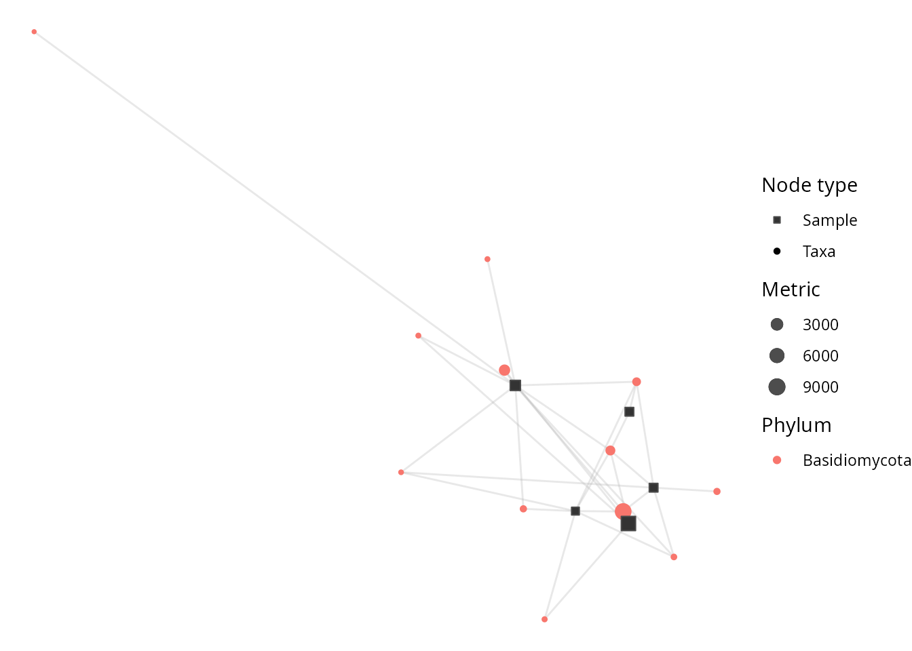

# Get started with netaipq

## What netaipq is for

`netaipq` is the [pqverse](https://github.com/adrientaudiere) home for
**networks and machine-learning** analyses of
[`phyloseq`](https://joey711.github.io/phyloseq/) objects: co-occurrence
and association networks, bipartite-network visualisation, supervised
classification, indicator-species and differential-abundance methods,
and other *genuinely new analysis methods* that go beyond a simple
`ggplot2` wrapper.

By absorbing any feature that would add a brand-new machine-learning,
network, graph, or statistical-analysis dependency, `netaipq` keeps
[`MiscMetabar`](https://adrientaudiere.github.io/MiscMetabar/) lean.
Pure `ggplot2` visualisation belongs in `ggplotpq`; cross-study
comparators belong in `comparpq`.

## Installation

``` r

# install.packages("remotes")
remotes::install_github("adrientaudiere/netaipq")
```

## A worked example: bipartite networks

A bipartite network links two kinds of nodes — here **samples** and
**taxa** — with an edge whenever a taxon occurs in a sample.
[`bipartite_network_pq()`](https://adrientaudiere.github.io/netaipq/reference/bipartite_network_pq.md)
builds and draws this network from a `phyloseq` object.

For a readable figure we take a few samples and the commonest taxa from
`data_fungi_mini` (shipped with `MiscMetabar`).

``` r

library(netaipq)
data(data_fungi_mini)

ps <- prune_samples(sample_names(data_fungi_mini)[1:5], data_fungi_mini)
ps <- clean_pq(ps, silent = TRUE)
top_taxa <- names(sort(taxa_sums(ps), decreasing = TRUE))[1:20]
ps <- prune_taxa(top_taxa, ps)
ps
#> phyloseq-class experiment-level object
#> otu_table()   OTU Table:         [ 12 taxa and 5 samples ]
#> sample_data() Sample Data:       [ 5 samples by 7 sample variables ]
#> tax_table()   Taxonomy Table:    [ 12 taxa by 12 taxonomic ranks ]
#> refseq()      DNAStringSet:      [ 12 reference sequences ]
```

``` r

bipartite_network_pq(ps, taxa_color = "Phylum", seed = 1)
```



Taxa nodes are coloured by their `Phylum`; edges connect each taxon to
the samples it was observed in. The function returns a `ggplot` object,
so you can post-process it with any `ggplot2` layer or theme — for
example those provided by `ggplotpq`.

## Where to go next

- The [function
  reference](https://adrientaudiere.github.io/netaipq/reference/index.html)
  lists every argument of
  [`bipartite_network_pq()`](https://adrientaudiere.github.io/netaipq/reference/bipartite_network_pq.md),
  including node sizing, layout, and label control.
- `netaipq` is in active development: network, machine-learning, and
  causal-inference methods are being added. See the
  [ROADMAP](https://github.com/adrientaudiere/pqverse/blob/master/ROADMAP.md)
  for what is coming next.
